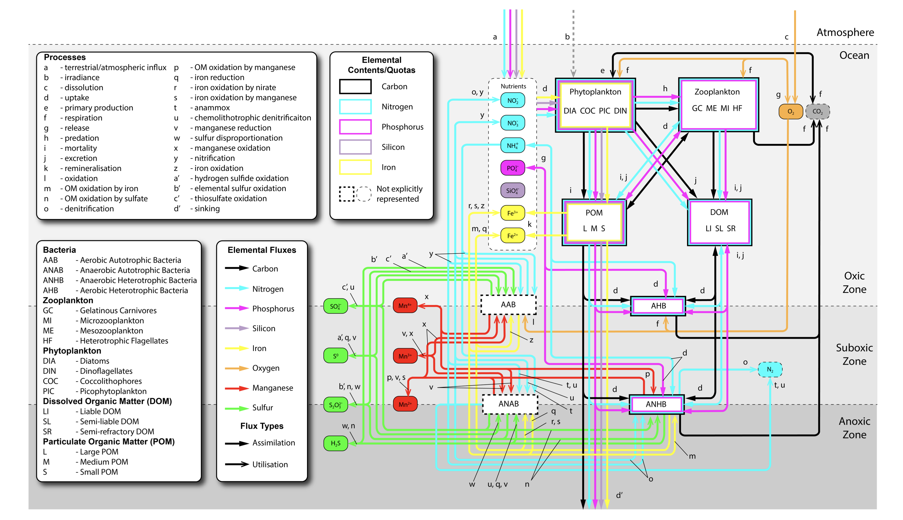

# TURSEM (Turkish Regional Seas Ecosystem Model)

The TURSEM model is a modified version of the [European Regional Seas Ecosystem Model (ERSEM)](https://github.com/pmlmodelling/ersem) tailored to simulate the unique environmental conditions of the Black Sea. Recognizing the region's distinct anoxic zones, TURSEM integrates the [Bottom Redox Model (BROM)](https://github.com/BottomRedoxModel) to accurately represent the biogeochemical processes occurring under low oxygen conditions. This coupling of ERSEM with BROM allows TURSEM to provide a detailed and realistic simulation of the Black Sea's ecosystem, addressing the specific challenges posed by its anoxic environment.

